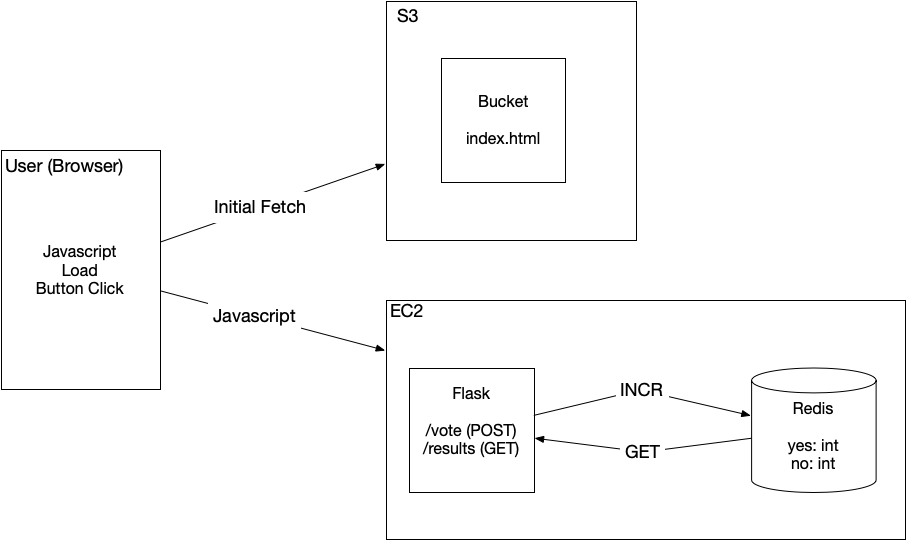

## Overview

This version of the voting system hosts the `index.html` file in an S3 bucket and the API for voting with Flask/Redis on an EC2 instance.




## Launch the API


For the `voting_monolith`, we created a security group named `httpssh`.  This security group should still be present.  You can check using the AWS CLI:

```
aws ec2 describe-security-groups
```

Assuming the `httpssh` group is present, we can launch the EC2 instance the same way we did with the `voting_monolith`:

```
aws ec2 run-instances --image-id ami-06b21ccaeff8cd686 --instance-type t2.micro --key-name vockey --security-groups httpssh --user-data file://userdata.sh --tag-specifications 'ResourceType=instance,Tags=[{Key=Name,Value=voting_monolith_cli}]'
```

Changes to this server:

* `\` no longer serves the `index.html` file
* We pass the`app` Flask object to a CORS method from the [Flask-CORS](https://flask-cors.readthedocs.io/en/latest/index.html) library.  This allows Cross-Origin Resource Sharing.


## Update the Static Webpage

The javascript in `index.html` uses the variable `server` to know where to get voting API.  This variable is declared on line 8 as `const server = 'http://FIXME-API-HOST-IP';`.  Replace the FIXME portion with the IP address of your EC2 instance.


## S3 Bucket Creation and Configuration

1. Create a bucket for the application:

  * **Name**:  Remember, names must be *globally unique*.  I recommend a name like `voting399-<last name>`. 
  * **Public Access**: Deselect "Block all public access" and then click the acknowledgement that appears below this option.


2. In the list of buckets, select the bucket to see the information about the bucket.  Under **Permissions** click "Edit" for the "Bucket Policy".  Add the following policy to allow anyone to GET objects in the bucket (change `<bucket name>`):


  ```
  {
      "Version": "2012-10-17",
      "Statement": [
          {
              "Sid": "PublicReadGetObject",
              "Effect": "Allow",
              "Principal": "*",
              "Action": "s3:GetObject",
              "Resource": "arn:aws:s3:::<bucket name>/*"
          }
      ]
  }
  ```
  
3. Under **Properties** click "Edit" for "Static website hosting"
  * Click "Enable"
  * For "Index Document": `index.html`

4. Add `index.html`

  ```
  aws s3 cp index.html s3:<bucket name>
  ```
  
    